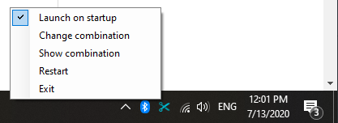
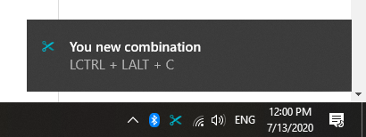

# Overview

This is a utility program made to facilitate the process of taking screenshots in Windows.

## Features

* Automatic updates
* Custom screenshot combination binding
* Extremly unobtrusite and easy to use
* Lightweight

# Installation

1. Go to the releases section of this repository: https://github.com/meJevin/ScreenCropperCSharp/releases

2. Select the desired version and download the installer file (Setup.exe or Setup.msi)

3. Run the installer

After the installation is done you will see new a tray icon appear:

Upon first launch, the application will ask you whether you want to run it upon Windows stratup or not. You can change this setting later as needed.  

# Usage

All of the control so far will be done via the tray icon that Screen Cropper creates upon stratup.

*Note*: If you can't see the tray icon it may be hidden in the Windows tray menu.

## Current combination

In order to start taking a screenshot you have to press a certain combination of keys on your keyboard.

By default, the combination is `LCtrl + LAlt + C`.

You can verify that by right clicking the tray icon and selecting `Show combination`

This combination can be overriden by right clicking the tray icon and selecting `Change combination`

## Changing the combination

When changing your combination you will seee the following message:

Hold down the keys that you want your new combination to be and hit `Enter`.

Upon successful change, you will see the following message:

## Taking a screenshot

When your current combination is pressed your screen will be covered with an opaque black overlay, which means you're taking a screenshot.

Select the desired screenshot area by holding down `LMB` and let go.

Done! Now the area you selected is in your clipboard!

*Note*: If you want to cancel taking a screenshot hit `Escape`.

## Launching on startup

If you want to change whether Screen Cropper launches on startup or not, right click the tray icon and toggle `Launch on startup` option.

# Issues

Sometimes, when one of the screens is disconnected and reconnected Screen Cropper may behave weird.

For that reason, there's a `Restart` button in the tray menu, which restarts the application.

If possible, submit the issues to this github repo :)
